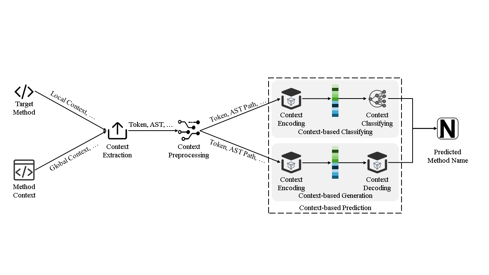

# Awesome Learning-based MNP

**NOTE: We plan to continue updating the latest papers, and PRs or issues about missing papers are also welcome.**

A collection of academic publications, methodology, metrics and datasets on the subject of **method name prediction (MNP) enhanced with deep/machine learning techniques**.

We welcome all researchers to contribute to this repository and further contribute to the knowledge of the learning-based MNP field.
Please feel free to contact us if you have any related references by Github issue or pull request. 

## Workflow of Learning-based MNP

## Collected Papers
-  **A General Path-Based Representation for Predicting Program Properties**.[[pdf](https://arxiv.org/abs/1803.09544)]
  - Uri Alon, Meital Zilberstein, Omer Levy, Eran Yahav. *PLDI*, 2018.
- **Characterizing the Natural Language Descriptions in Software Logging Statements**.[[pdf](https://dl.acm.org/doi/10.1145/3238147.3238193)][[code](https://github.com/logpai/LoggingDescriptions)]
  - Pinjia He, Zhuangbin Chen, Shilin He, Michael R. Lyu. *ASE*, 2018.
- **code2vec: Learning Distributed Representations of Code**.[[pdf](http://arxiv.org/abs/1803.09473)][[code](https://github.com/tech-srl/code2vec)]
  - Uri Alon, Meital Zilberstein, Omer Levy, Eran Yahav. *POPL*, 2019.
- **code2seq: Generating Sequences from Structured Representations of Code**.[[pdf](http://arxiv.org/abs/1808.01400)][[code](https://github.com/tech-srl/code2seq)]
  - Uri Alon, Shaked Brody, Omer Levy, Eran Yahav. *ICLR*, 2019.
- **Machine Learning Based Recommendation of Method Names: How Far are We**.[[pdf](https://ieeexplore.ieee.org/document/8952208)][[code](https://github.com/Method-Name-Recommendation/HeMa)]
  - Lin Jiang, Hui Liu, He Jiang. *ASE*, 2019.
- **Mercem: Method Name Recommendation Based on Call Graph Embedding**.[[pdf](http://arxiv.org/abs/1907.05690)][[code](https://groups.inf.ed.ac.uk/cup/codeattention/)]
  - Hiroshi Yonai, Yasuhiro Hayase, Hiroyuki Kitagawa. *APSEC*, 2019.
- **Method Name Suggestion with Hierarchical Attention Networks**.[[pdf](https://doi.org/10.1145/3294032.3294079)][[code](https://github.com/XuSihan/CodeSum2)]
  - Sihan Xu, Sen Zhang, Weijing Wang, Xinya Cao, Chenkai Guo, Jing Xu. *PEPM@POPL*, 2019.
-  **Recovering Variable Names for Minified Code with Usage Contexts**.[[pdf](http://arxiv.org/abs/1906.03488)][[code](https://mrstarrynight.github.io/JSNeat/)]
  - Hieu Tran, Ngoc M. Tran, Son Nguyen, Hoan Nguyen, Tien N. Nguyen. *ICSE*, 2019.
- **Embedding Java Classes with code2vec: Improvements from Variable Obfuscation**.[[pdf](https://arxiv.org/abs/2004.02942)][[code](https://github.com/basedrhys/obfuscated-code2vec)]
  - Rhys Compton, Eibe Frank, Panos Patros, Abigail Koay. *MSR*, 2020.
- **Learning Semantic Program Embeddings with Graph Interval Neural Network**.[[pdf](https://arxiv.org/abs/2005.09997)][[code](https://github.com/GINN-Imp/GINN)]
  - Yu Wang, Ke Wang, Fengjuan Gao, Linzhang Wang. *OOPSLA*, 2020.
- **Towards Demystifying Dimensions of Source Code Embeddings**.[[pdf](https://arxiv.org/abs/2008.13064)][[code](https://github.com/mdrafiqulrabin/handcrafted-embeddings)]
  - Md. Rafiqul Islam Rabin, Arjun Mukherjee, Omprakash Gnawali, Mohammad Amin Alipour. arXiv, 2020.
- **Suggesting Natural Method Names to Check Name Consistencies**.[[pdf](https://doi.org/10.1145/3377811.3380926)][[code](https://doubledoubleblind.github.io/mnire/)]
  - Son Nguyen, Hung Phan, Trinh Le, Tien N. Nguyen:. *ICSE*, 2020.
-  **Blended, Precise Semantic Program Embeddings**.[[pdf](https://doi.org/10.1145/3385412.3385999)]
  - Ke Wang, Zhendong Su. *PLDI*, 2020.
- **InferCode: Self-Supervised Learning of Code Representations by Predicting Subtrees**.[[pdf](https://arxiv.org/abs/2012.07023)][[code](https://github.com/ICSE21/infercode)]
  - Nghi D. Q. Bui, Yijun Yu, Lingxiao Jiang. *ICSE*, 2021.
- **A Mocktail of Source Code Representations**.[[pdf](https://arxiv.org/abs/2106.10918)][[code](https://github.com/NobleMathews/mocktail-blend)]
  - Dheeraj Vagavolu, Karthik Chandra Swarna, Sridhar Chimalakonda. *ASE*, 2021.
-  **A Lightweight Framework for Function Name Reassignment Based on Large-scale Stripped Binaries**.[[pdf](https://doi.org/10.1145/3460319.3464804)][[code](https://github.com/USTC-TTCN/NFRE)]
  - Han Gao, Shaoyin Cheng, Yinxing Xue, Weiming Zhang. *ISSTA*, 2021.
- **PSIMiner: A Tool for Mining Rich Abstract Syntax Trees from Code**.[[pdf](https://arxiv.org/abs/2103.12778)][[code](https://github.com/JetBrains-Research/code2seq)]
  - Egor Spirin, Egor Bogomolov, Vladimir Kovalenko, Timofey Bryksin. *MSR*, 2021.
- **A Hybrid Code Representation Learning Approach for Predicting Method Names**.[[pdf](https://doi.org/10.1016/j.jss.2021.111011)][[code](https://meth2seq.github.io/meth2seq/)]
  - Fengyi Zhang, Bihuan Chen, Rongfan Li, Xin Peng. *Journal of Systems and Software*, 2021.
- **Universal Representation for Code**.[[pdf](https://arxiv.org/abs/2103.03116)][[code](https://github.com/dmlc/dgl/tree/master/examples/pytorch/rgcn-hetero)]
  - Linfeng Liu, Hoan Nguyen, George Karypis, Srinivasan Sengamedu. *PAKDD*, 2021.
- **Lightweight Global and Local Contexts Guided Method Name Recommendation with Prior Knowledge**.[[pdf](https://doi.org/10.1145/3468264.3468567)][[code](https://github.com/ShangwenWang/Cognac)]
  - Shangwen Wang, Ming Wen, Bo Lin, Xiaoguang Mao. *FSE*, 2021.
- **A Context-based Automated Approach for Method Name Consistency Checking and Suggestion**.[[pdf](https://arxiv.org/abs/2103.00269)][[code](https://github.com/deepname2021icse/DeepName-2021-ICSE)]
  - Yi Li, Shaohua Wang, Tien N. Nguyen. *ICSE*, 2021.
-  **Thinking Like a Developer? Comparing the Attention of Humans with Neural Models of Code**.[[pdf](https://doi.org/10.1109/ASE51524.2021.9678712)][[code](https://github.com/MattePalte/thinking-like-a-developer)]
  - Matteo Paltenghi, Michael Pradel. *ASE*, 2021.
-   **Learning to Find Naming Issues with Big Code and Small Supervision**.[[pdf](https://doi.org/10.1145/3453483.3454045)][[code](https://github.com/paulhildebrandt)]
  - Jingxuan He, Cheng-Chun Lee, Veselin Raychev, Martin T. Vechev. *PLDI*, 2021.
- **GraphCode2Vec: Generic Code Embedding via Lexical and Program Dependence Analyses**.[[pdf](https://arxiv.org/abs/2112.01218)][[code](https://github.com/graphcode2vec/graphcode2vec)]
  - Wei Ma, Mengjie Zhao, Ezekiel O. Soremekun, Qiang Hu, Jie M. Zhang, Mike Papadakis, Maxime Cordy, Xiaofei Xie, Yves Le Traon. *MSR*, 2022.
- **Learning to Represent Programs with Heterogeneous Graphs**.[[pdf](https://arxiv.org/abs/2012.04188)][[code](https://github.com/IBM/Project_CodeNet/issues/29)]
  - Kechi Zhang, Wenhan Wang, Huangzhao Zhang, Ge Li, Zhi Jin. *ICPC*, 2022.
- **Multilingual Training for Software Engineering**.[[pdf](https://arxiv.org/abs/2112.02043)][[code](https://github.com/microsoft/CodeXGLUE/tree/main/Code-Text/code-to-text)]
  - Toufique Ahmed, Premkumar T. Devanbu. *ICSE*, 2022.
- **Learning to Recommend Method Names with Global Context**.[[pdf](https://arxiv.org/abs/2201.10705)]
  - Fang Liu, Ge Li, Zhiyi Fu, Shuai Lu, Yiyang Hao, Zhi Jin. *ICSE*, 2022.
-  **SymLM: Predicting Function Names in Stripped Binaries via Context-Sensitive Execution-Aware Code Embeddings**.[[pdf](https://doi.org/10.1145/3548606.3560612)][[code](https://github.com/OSUSecLab/SymLM)]
  - Xin Jin, Kexin Pei, Jun Yeon Won, Zhiqiang Lin. *CCS*, 2022.
- **Method Name Prediction for Automatically Generated Unit Tests**.[[pdf](https://ieeexplore.ieee.org/abstract/document/9763112)][[code](https://github.com/kk-arman/graph_names/)]
  - Maxim Petukhov, Evelina Gudauskayte, Arman Kaliyev, Mikhail Oskin, Dmitry Ivanov, Qianxiang Wang. *ICCQ*, 2022.
- **A Naming Pattern Based Approach for Method Name Recommendation**.[[pdf](https://doi.org/10.1109/ISSRE55969.2022.00041)][[code](https://github.com/cqu-isse/NamPat)]
  - Yanping Yang, Ling Xu, Meng Yan, Zhou Xu, Zhongyang Deng. *ISSRE*, 2022.
-  **A Review on Source Code Documentation**.[[pdf](https://dl.acm.org/doi/10.1145/3519312)]
  - Sawan Rai, Ramesh Chandra Belwal, Atul Gupta. *ACM Transactions on Intelligent DSystems and Technology*, 2022.
- **Method name recommendation based on source code metrics**.[[pdf](https://www.sciencedirect.com/science/article/abs/pii/S2590118422000740?via%3Dihub)][[code](https://github.com/m-zakeri/SENSA)]
  - Saeed Parsa, Morteza Zakeri Nasrabadi, Masoud Ekhtiarzadeh, Mohammad Ramezani. *Journal of Computer Languages*, 2023.
- **Fold2Vec: Towards a Statement-Based Representation of Code for Code Comprehension**.[[pdf](https://dl.acm.org/doi/10.1145/3514232)][[code](https://cazzola.di.unimi.it/fold2vec.html)]
  - Francesco Bertolotti, Walter Cazzola. *ACM Transactions on Software Engineering and Methodology*, 2023.
- **Mining Source Code Repositories at Massive Scale using Language Modeling**.[[pdf](https://ieeexplore.ieee.org/document/6624029)][[code](http://groups.inf.ed.ac.uk/cup/javaGithub/)]
  - Miltiadis Allamanis, Charles Sutton. *MSR*, 2013.
- **An approach for evaluating and suggesting method names using n-gram models**.[[pdf](https://dl.acm.org/doi/10.1145/2597008.2597797)]
  - Takayuki Suzuki, Kazunori Sakamoto, Fuyuki Ishikawa, Shinichi Honiden. *ICPC*, 2014.
- **Code completion with statistical language models**.[[pdf](https://dl.acm.org/doi/10.1145/2594291.2594321#tab-contributors)]
  - Veselin Raychev, Martin Vechev, Eran Yahav. *PLDI*, 2014.
- **Suggesting accurate method and class names**.[[[pdf](https://dl.acm.org/doi/10.1145/2786805.2786849)]]
  - Miltiadis Allamanis, Earl T. Barr, Christian Bird, Charles Sutton. *ESEC/FSE*, 2015.
- **A Convolutional Attention Network for Extreme Summarization of Source Code**.[[pdf](https://arxiv.org/abs/1602.03001)][[code] (https://groups.inf.ed.ac.uk/cup/codeattention/)]
  - Miltiadis Allamanis, Hao Peng, Charles Sutton. *ICML*, 2016.
- **Learning to Spot and Refactor Inconsistent Method Names**.[[pdf](https://ieeexplore.ieee.org/abstract/document/8812134)][[code](https://github.com/TruX-DTF/debug-method-name)]
  - Kui Liu, Dongsun Kim, Tegawendé F. Bissyandé, Taeyoung Kim, Kisub Kim, Anil Koyuncu, Suntae Kim, Yves Le Traon. *ICSE*, 2019.
- **Structured Neural Summarization**.[[pdf](https://arxiv.org/abs/1811.01824)][[code](https://github.com/CoderPat/structured-neural-summarization)]
  - Patrick Fernandes, Miltiadis Allamanis, Marc Brockschmidt. *ICLR*, 2019.
- **A Neural Model for Method Name Generation from Functional Description**.[[pdf](https://ieeexplore.ieee.org/document/8667994)][[code](https://bit.ly/2MLSxFg)]
  - Sa Gao, Chunyang Chen, Zhenchang Xing, Yukun Ma, Wen Song, Shang-Wei Lin. *SANER*, 2019.
- **Neural Model for Generating Method Names from Combined Contexts**.[[pdf](https://ieeexplore.ieee.org/document/9951043)]
  - Zane Varner, Çerağ Oğuztüzün, Feng Long. *STC*, 2022.
- **Flow2Vec: value-flow-based precise code embedding**.[[pdf](https://dl.acm.org/doi/10.1145/3428301)]
  - Yulei Sui, Xiao Cheng, Guanqin Zhang, Haoyu Wang. *PACMPL*, 2020.
- **Suggesting Descriptive Method Names: An Exploratory Study of Two Machine Learning Approaches**.[[pdf](https://link.springer.com/chapter/10.1007/978-3-030-58793-2_8)]
  - Oleksandr Zaitsev,  Stephane Ducasse,  Alexandre Bergel, Mathieu Eveillard . *QUATIC*,2020.
- **Pointing to Subwords for Generating Function Names in Source Code**.[[pdf](https://aclanthology.org/2020.coling-main.28/)]
  - Shogo Fujita, Hidetaka Kamigaito, Hiroya Takamura, Manabu Okumura. *COLING*, 2020.
- **Exploiting Method Names to Improve Code Summarization: A Deliberation Multi-Task Learning Approach**.[[pdf](https://ieeexplore.ieee.org/document/9462964)]
  - Rui Xie, Wei Ye, Jinan Sun, Shikun Zhang. *ICPC*, 2021.
- **Integrating tree path in transformer for code representation**.[[pdf](https://proceedings.neurips.cc/paper/2021/hash/4e0223a87610176ef0d24ef6d2dcde3a-Abstract.html)]
  - Han Peng, Ge Li, Wenhan Wang, Yunfei Zhao, Zhi Jin. *NeurIPS*, 2021.
- **Keywords Guided Method Name Generation**.[[pdf](https://ieeexplore.ieee.org/document/9463019)][[code](https://github.com/css518/Keywords-Guided-Method-Name-Generation)]
  - Fan Ge; Li Kuang. *ICPC*, 2021.
- **Language-Agnostic Representation Learning of Source Code from Structure and Context**.[[pdf](https://arxiv.org/abs/2103.11318)]
  - Daniel Zügner, Tobias Kirschstein, Michele Catasta, Jure Leskovec, Stephan Günnemann. *ICLR*, 2021.
- **On the generalizability of Neural Program Models with respect to semantic-preserving program transformations**.[[[pdf](https://www.sciencedirect.com/science/article/abs/pii/S0950584921000379)][[code](https://github.com/mdrafiqulrabin/tnpa-generalizability/)]
  - Md Rafiqul Islam Rabin, Nghi D.Q. Bui, Ke Wang, Yijun Yu, Lingxiao Jiang, Mohammad Amin Alipour. *Information and Software Technology*, 2021.
- **TreeCaps: Tree-Based Capsule Networks for Source Code Processing**.[[pdf](https://ojs.aaai.org/index.php/AAAI/article/view/16074)][[code](https://github.com/bdqnghi/treecaps)]
  - Nghi D. Q. Bui, Yijun Yu, Lingxiao Jiang. *AAAI*, 20.
- **Method Name Generation Based on Code Structure Guidance**.[[pdf](https://ieeexplore.ieee.org/document/9825891)]
  - Zhiheng Qu, Yi Hu, Jianhui Zeng, Bo Cai, Shun Yang. *SANER*, 2022.
- **Path context augmented statement and network for learning programs**.[[pdf](https://link.springer.com/article/10.1007/s10664-021-10098-y)]
  - Da Xiao, Dengji Hang, Lu Ai, Shengping Li & Hongliang Liang. *Empirical Software Engineering*,  2022.
- **Pre-implementation Method Name Prediction for Object-oriented Programming**.[[pdf](https://dl.acm.org/doi/10.1145/3597203)][[code](https://github.com/ShangwenWang/Mario)]
  - Shangwen Wang, Ming Wen, Bo Lin, Yepang Liu, Tegawendé F. Bissyandé, Xiaoguang Mao. *TOSEM*,  2023.
- **Towards Better ML-Based Software Services: An Investigation of Source Code Engineering Impact**.[[pdf](https://ieeexplore.ieee.org/document/10234350)][[code](https://groups.inf.ed.ac.uk/cup/naturalize/#evaldata)]
  - Yanli Li, Chongbin Ye, Huaming Chen, Shiping Chen, Minhui Xue, Jun Shen. *SSE*, 2023.
- **Automating Method Naming with Context-Aware Prompt-Tuning**.[[pdf](https://ieeexplore.ieee.org/abstract/document/10174153)][[code](https://figshare.com/s/0382ba979d970b4c2b23)]
  - Jie Zhu, Lingwei Li, Li Yang, Xiaoxiao Ma, Chun Zuo. *ICPC*, 2023.
- **Just-In-Time Method Name Updating With Heuristics and Neural Model**.[[pdf](https://ieeexplore.ieee.org/document/10366565)][[code](https://anonymous.4open.science/r/MNU-139/)]
  - Zhenting Guo, Meng Yan, Hongyan Li, Zhezhe Chen, Weifeng Sun. *QRS*, 2023.

## Datasets
| Dataset Name | Link | Source| #Papers in MNP Used |
| :-- | --- | --- | --- |
| Java-small | [link](https://github.com/tech-srl/code2vec) | GitHub | 14+ papers |
| Java-med | [link](https://github.com/tech-srl/code2vec) | GitHub | 8+ papers |
| Java-large | [link](https://github.com/tech-srl/code2vec) | GitHub | 10+ papers |
| codeattention | [link](https://groups.inf.ed.ac.uk/cup/codeattention/) | GitHub | 1+ papers |
| CodeSum2 | [link](https://github.com/XuSihan/CodeSum2) |GitHub | 1+ papers |
| CoderPat | [link](https://github.com/CoderPat/}\\\url{structured-neural-summarization) |GitHub | 1+ papers |
| - | [link](https://drive.google.com/file/d/}\\\url{1fNSmPluXbhQ9cfcAHkTtNrHlD8Jkh2XD) |GitHub | 1+ papers |
| Mnire | [link](https://sonvnguyen.github.io/mnire/#datasets) | GitHub | 6+ papers |
| Flow2vec | [link]([artifact4oopsla20/Flow2Vec (github.com)](https://github.com/artifact4oopsla20/Flow2Vec?tab=readme-ov-file\#21-code-classification-and-summarization-table-2)) | GitHub | 1+ papers |
| OGB | [link](https://ogb.stanford.edu/) | Stanford OGB | 1+ papers |
| Meth2Seq | [link](https://meth2seq.github.io/meth2seq/) | GitHub | 1+ papers |
| Mocktail Dataset | [link](https://archive.org/download/mocktail-dataset-method-naming-tse) | GitHub | 1+ papers |
| Python Summary Dataset | [link](https://github.com/EdinburghNLP/code-docstring-corpus) | GitHub | 1+ papers |
| CodeSearchNet | [link](https://github.com/github/CodeSearchNet) | GitHub | 1+ papers |
| Java2Graph | [link](https://github.com/kk-arman/graph_names/) | GitHub | 1+ papers |
| CodeXGLUE | [link](https://microsoft.github.io/CodeXGLUE/) | GitHub | 11+ papers |
| JavaRepos | [link](https://github.com/TruX-DTF/debug-method-name) | Apache, Spring,Hibernate,and Google | 1+ papers |
| 150k Python Dataset | [link](https://www.sri.inf.ethz.ch/py150) | GitHub | 1+ papers |

## Evaluation Metrics
| Metrics | Description |
| ---- | ---- |
| Precision | Precision refers to the proportion of correctly predicted method name tokens from the total number of predicted method name tokens. It measures the accuracy of the MNP technique. |
| Recall | Recall is the proportion of correctly predicted method name tokens to the total number of tokens in the target method name. It measures the recall ability of the MNP technique.|
| F1-score | The F1-score is the harmonic mean of precision and recall and provides a comprehensive measure of system performance. A high F1-score indicates a good balance between precision and recall. |
| EM | The exact match (EM) is whether the model’s predictions exactly match the true results. For tasks such as sequence annotation, each annotation is required to be correct to be considered a match. |
| ROGUE | Recall-Oriented Understudy for Gisting Evaluation (ROGUE) is a set of metrics for evaluating text summarization systems. ROGUE evaluates the performance of a model by comparing the similarity of the generated summaries to a reference summary.|
| BLEU | BLEU is a commonly used metric in machine translation tasks to measure the accuracy of translated candidate sentences against reference sentences. It compares how many words in the target sequence appear in the decoded sequence. |
| ED | ED is a commonly used metric for measuring the difference between two strings, calculating the minimum number of operations required to transform the generated string into the target string. |
| Accuracy | Accuracy is a metric used to assess the performance of classification models,indicating the proportion of correct predictions among all predictions made. |
| AED  RED | AED is a metric for measuring edit operations, used to calculate the average number of edits required to transform the generated name into the target name. RED is used in method name consistency detection scenarios, and, compared to absolute edit distance, RED better reflects the relative differences and improvements between the newly generated name and the original name. |
| METEOR | METEOR is a commonly used metric for evaluating machine translation quality. It measures translation accuracy and completeness by combining the harmonic mean of precision and recall. |

